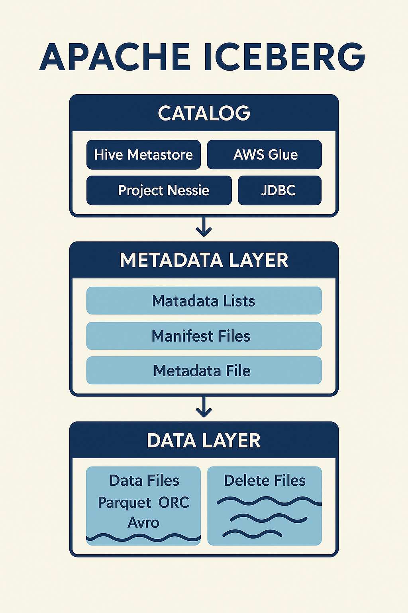

## Куратор раздела


**Подвальный Артем**, 
                                                                                                                      Data Engineer

   [Канал Data Engineer Lab](https://t.me/dataengineerlab)

Хочешь перейти в дата-инженерию, но не знаешь с чего начать? Пиши -  составим резюме, продумаем твое развитие [https://t.me/ampodvalniy](https://t.me/ampodvalniy)

Хочешь улучшить текущий раздел, внести недостающее или поправить формулировку? Предлагай PR и тегай [@Artemlin6231](https://github.com/Artemlin6231)

## Немного об этой главе
Многие компания начинают сейчас переходить на Iceberg и концепцию Lakehouse. Так что знакомство с данным форматом данных позволит держать руку на пульсе)

Приятного изучения)


# Apache Iceberg

## Введение

Данные стали ключевым активом для организаций: они необходимы для анализа
тенденций, построения прогнозов и поддержки принятия решений. Рост объёмов
и скорости генерации данных потребовал появления новых архитектур
хранения и обработки.

Раньше использовались:
- **Хранилища данных (Data Warehouse)** — надёжные, но дорогие и ограниченные
только структурированными данными.
- **Озёра данных (Data Lake)** — гибкие и дешёвые, но без гарантий ACID
и полноценной работы с транзакциями.

Появился запрос на архитектуру, которая сочетает гибкость озёр данных
и надёжность хранилищ.

---

## Что такое Apache Iceberg?

**Apache Iceberg** — это открытый табличный формат для озёр данных,
который:
- Абстрагирует физическое хранение файлов.
- Обеспечивает транзакционность (ACID) и управление версиями (snapshots).
- Поддерживает эволюцию схем и секционирования без миграции данных.
- Делает возможной эффективную SQL-аналитику прямо в Data Lake.

---

## Ключевые преимущества

- **Гибкость**: хранение любых форматов данных (Parquet, ORC, Avro).
- **Транзакции**: безопасные вставки, обновления, удаления.
- **Time Travel**: доступ к состоянию таблицы в прошлом.
- **Совместимость**: интеграция с Apache Spark, Flink, Trino, Dremio и другими движками.
- **Масштабируемость**: изначально разработан для работы с петабайтами данных (Netflix).


## Архитектура Apache Iceberg

Apache Iceberg построен по многоуровневой архитектуре, которая разделяет
данные, метаданные и каталог. Такой подход обеспечивает масштабируемость,
гибкость и поддержку транзакций ACID в озёрах данных.


<p align="center">
   
</p>
---

### 1. Слой данных (Data Layer)
- Хранит фактические данные таблицы.  
- Элементы:
  - **Файлы данных** (Parquet, ORC, Avro) — содержат строки таблицы.  
  - **Файлы удаления** — описывают строки или файлы, которые были удалены
    (`DELETE`, `MERGE`).  
- Данные обычно размещаются в распределённых файловых системах (**HDFS**) или
объектных хранилищах (**Amazon S3, ADLS, GCS**).  
- Слой независим от вычислительного движка, что делает его универсальным.

---

### 2. Слой метаданных (Metadata Layer)
- Центральная часть Iceberg, отвечающая за структуру и историю таблицы.  
- Состоит из:
  - **Файлов манифеста** — список файлов данных и статистика по ним
    (кол-во строк, min/max значения).  
  - **Списков манифестов** — объединяют манифесты в один снимок (snapshot).  
  - **Файлов метаданных** — определяют схему, секционирование, список снимков.  
  - **Puffin-файлов** — хранят расширенную статистику и метрики.  
- Метаданные образуют дерево, что позволяет эффективно планировать запросы,
используя partition pruning и статистику.

---

### 3. Каталог (Catalog Layer)
- Управляет именами таблиц и указывает на актуальные файлы метаданных.  
- Вместо хранения путей к директориям (как в Hive) Iceberg работает
с **ссылкой на последний мета-файл**.  
- Поддерживаемые реализации:
  - **Hive Metastore**  
  - **AWS Glue**  
  - **Project Nessie**  
  - **JDBC/REST-каталоги**  
- Каталог обеспечивает согласованность между различными движками
(Spark, Flink, Trino и др.).

---

## Ключевые особенности архитектуры
- **ACID-транзакции** без централизованной СУБД.  
- **Эволюция схемы и секционирования** без миграции данных.  
- **Time travel** — возможность читать таблицу в прошлом состоянии.  
- **Масштабируемость** — изначально спроектирован для работы с петабайтами данных.  

---


## Файлы удаления и стратегии записи (MOR vs COW)

В Apache Iceberg операции `DELETE` и `UPDATE` реализуются через специальные
**файлы удаления (delete files)**. Они позволяют эффективно управлять изменениями,
не переписывая сразу все данные.

---

### Типы файлов удаления

1. **Position Deletes**
   - Содержат ссылки на конкретные строки в файле данных по смещению (row position).
   - Подходят для точечных обновлений и удалений.

2. **Equality Deletes**
   - Хранят условие удаления по значениям столбцов (например: `user_id=12345`).
   - Удобны для массовых удалений или обновлений по ключу.

---

### Стратегии записи

#### 1. Copy-on-Write (COW)
- При обновлениях или удалениях Iceberg **переписывает целый файл данных**,
  исключая ненужные строки.
- **Плюсы**:
  - Простая модель — при чтении не требуется дополнительная обработка.
  - Быстрое и лёгкое чтение.
- **Минусы**:
  - Запись дороже по времени и ресурсам (особенно при малых изменениях).
- **Когда использовать**:
  - Таблицы с редкими изменениями.
  - Сценарии, где приоритет — скорость чтения.

#### 2. Merge-on-Read (MOR)
- Изменения фиксируются во **файлах удаления**, а переписывание файлов откладывается.
- При чтении движок объединяет (merge) данные и delete-файлы.
- **Плюсы**:
  - Быстрая запись, минимальные накладные расходы на обновления.
  - Подходит для потоковой загрузки (streaming).
- **Минусы**:
  - Более тяжёлое чтение (нужно применять delete-файлы поверх данных).
- **Когда использовать**:
  - Таблицы с частыми обновлениями.
  - Real-time аналитика, где важна скорость записи.

---

### Сравнение COW и MOR

| Характеристика      | Copy-on-Write (COW)       | Merge-on-Read (MOR)        |
|---------------------|---------------------------|-----------------------------|
| Скорость записи     | Медленная (переписывание) | Быстрая (delete files)     |
| Скорость чтения     | Быстрая                   | Медленнее (merge при чтении)|
| Простота модели     | Простая                   | Более сложная              |
| Использование       | Batch-аналитика           | Streaming и частые апдейты |


## Примеры работы с таблицами(отличные от обычного SQL)


```python
#запуск spark-сессии с iceberg

from pyspark.sql import SparkSession

spark = (
    SparkSession.builder
    .appName("IcebergExample")
    .config("spark.sql.catalog.my_catalog", "org.apache.iceberg.spark.SparkCatalog")
    .config("spark.sql.catalog.my_catalog.type", "hive")
    .config("spark.sql.catalog.my_catalog.uri", "thrift://localhost:9083")
    .getOrCreate()
)
# Создание таблицы
spark.sql("""
CREATE TABLE my_catalog.db.orders (
  order_id BIGINT,
  customer_id BIGINT,
  amount DECIMAL(10,2),
  created_at TIMESTAMP
)
USING iceberg
PARTITIONED BY (days(created_at))
""")

# Time travel (по snapshot-id)
spark.sql("""
SELECT * FROM my_catalog.db.orders VERSION AS OF 918273645
""").show()

# Time travel (по времени)
spark.sql("""
SELECT * FROM my_catalog.db.orders TIMESTAMP AS OF '2025-09-28 14:00:00'
""").show()

# Компактизация файлов
spark.sql("""
CALL my_catalog.system.rewrite_data_files('db.orders')
""")

# Очистка старых снапшотов
spark.sql("""
CALL my_catalog.system.expire_snapshots('db.orders')
  WHERE committed_at < TIMESTAMP '2025-09-01 00:00:00'
""")

# Удаление delete-файлов
spark.sql("""
CALL my_catalog.system.remove_orphan_files('db.orders')
""")

