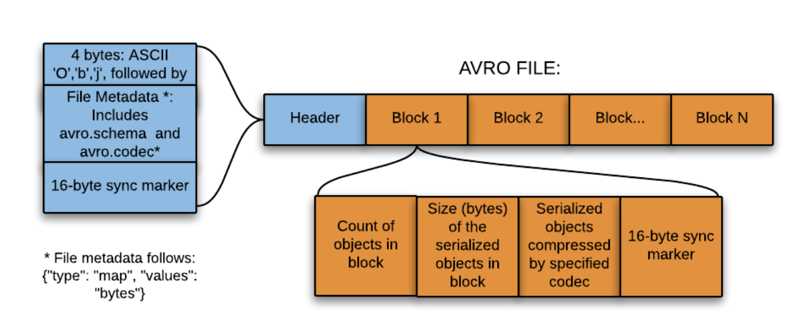
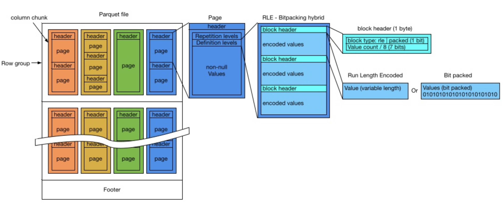
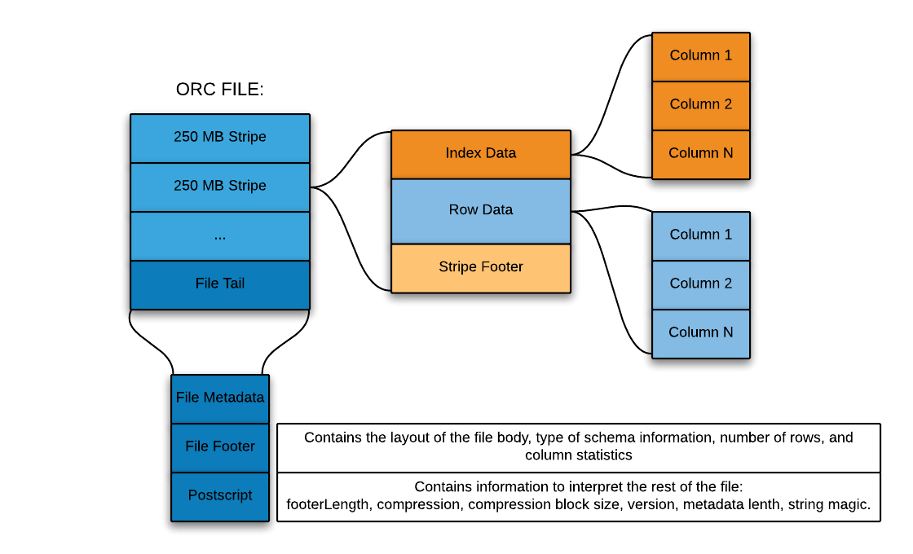
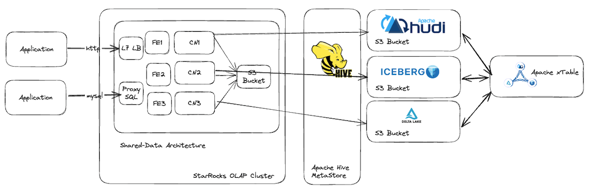
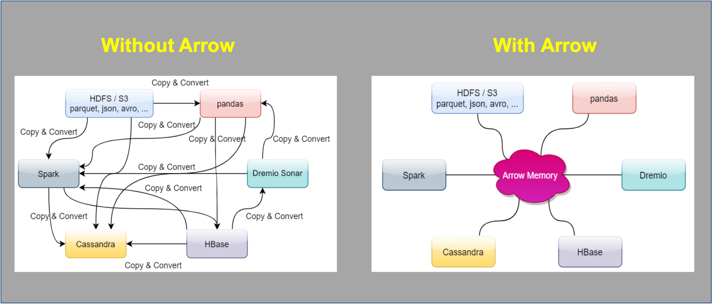

<!-- Yandex.Metrika counter -->
<script type="text/javascript">
    (function(m,e,t,r,i,k,a){
        m[i]=m[i]||function(){(m[i].a=m[i].a||[]).push(arguments)};
        m[i].l=1*new Date();
        for (var j = 0; j < document.scripts.length; j++) {if (document.scripts[j].src === r) { return; }}
        k=e.createElement(t),a=e.getElementsByTagName(t)[0],k.async=1,k.src=r,a.parentNode.insertBefore(k,a)
    })(window, document,'script','https://mc.yandex.ru/metrika/tag.js?id=103580753', 'ym');

    ym(103580753, 'init', {ssr:true, webvisor:true, clickmap:true, ecommerce:"dataLayer", accurateTrackBounce:true, trackLinks:true});
</script>
<noscript><div></div></noscript>
<!-- /Yandex.Metrika counter -->
## Куратор раздела


**Дарьин Александр**, старший аналитик данных в ООО СберТройка, ментор 9 потока по DE в Simulative, автор тлг канала ["Аналитик на минималках" ](https://t.me/junior_analyst), но 3 года назад был товарным оператором на заводе Роснефть, который наливал товарные масла в ж/д вагоны, а еще 2 годами ранее там же работал грузчиком и рохлей грузил фуры паллетами с 200 л бочками товарного масла. Не так давно родилась дочка, с которой на машине преодолели путь в 5 тыс км и семьей сменили место жительства - был Иркутск, стала Москва.

Моя цель -  развиваться в дата инженерии, аналитике, разработке, ai. Если наши цели совпадают и есть что обсудить, то велком по прямой связи  https://t.me/darin_aleksandr.

Хочешь улучшить текущий раздел, внести недостающее или поправить формулировку? Предлагай PR и тегай [@Darin-Aleksandr](https://github.com/Darin-Aleksandr).

Приятного изучения.

-----------------

# Эволюция форматов данных в BigData

Основной тренд: переход от **текстовых, человеко-читаемых** форматов к **бинарным, оптимизированным для систем обработки** с акцентом на эффективность хранения и скорость чтения.

### 1. Эра текстовых форматов (XML, JSON, CSV)

Использовались изначально, так как были стандартом де-факто для веба и обмена данными. Главная проблема для BigData — **избыточность и низкая эффективность**.

---

- XML (ранние 2000-е)**
    
    - **Особенность:** Строгая структура, поддерживает схемы (XSD), вложенность.
        
    - **Проблемы для BigData:** Очень много лишних символов (теги, атрибуты). Высокий overhead при парсинге. Плохо подходит для колоночных операций.
        
    - **Итог:** В чистом виде для хранения больших данных почти не используется, кроме некоторых legacy-систем или специфичных доменов (например, SOAP-сервисы).

```xml
<?xml version="1.0" encoding="UTF-8"?>
<config>
    <database>
        <host>localhost</host>
        <port>5432</port>
        <name>company_db</name>
        <username>admin</username>
    </database>
    <api_settings>
        <timeout>30</timeout>
        <retry_attempts>3</retry_attempts>
        <base_url>https://api.example.com</base_url>
    </api_settings>
</config>
```

---
- **JSON (середина 2000-х)**
    
    - **Особенность:** Менее verbose, чем XML. Отлично подходит для API и полуструктурированных данных. Прост для понимания и генерации.
        
    - **Проблемы для BigData:** Все еще текстовый, а значит — неэффективное сжатие. Не поддерживает типы данных в чистом виде (все строки). Парсинг требует полной загрузки объекта. Отсутствие схемы "из коробки" (хотя JSON Schema существует).
        
    - **Итог:** Де-факто стандарт для _приема_ данных (логи, события с веб-серверов, сообщения из Kafka). Но для хранения и аналитики заменяется на бинарные форматы.

```json
{
  "company": {
    "name": "ТехноКорп",
    "industry": "IT",
    "founded": 2010,
    "employees": 250,
    "departments": {
      "it": {
        "head_count": 100,
        "budget": 5000000,
        "projects": ["Система аналитики", "Мобильное приложение"]
      },
      "sales": {
        "head_count": 80,
        "budget": 3000000,
        "regions": ["Европа", "Азия", "Северная Америка"]
      }
    }
  }
}
```

---

- **CSV/TSV** (в TSV разделитель TAB)
    
    - **Особенность:** Максимально простой, компактный (для текста). Легко генерировать и читать человеку.
        
    - **Проблемы для BigData:** Отсутствие информации о типах данных (все колонки — строки). Проблемы с экранированием, разными разделителями. Нет поддержки вложенных структур. Чтение требует сканирования всей строки, даже если нужна одна колонка.
        
    - **Итог:** Подходит для сырых данных на начальном этапе (raw layer) или обмена с внешними системами, но крайне неэффективен для обработки.

```csv
transaction_id;account_id;transaction_type;amount;currency;description;timestamp;is_fraud
TX1001;ACC001;DEBIT;150.75;USD;"Payment for services";2024-01-15T10:30:00Z;false
TX1002;ACC002;CREDIT;200.00;EUR;"Salary payment";2024-01-15T09:15:00Z;false
TX1003;ACC003;DEBIT;5000.00;USD;"Suspicious transfer";2024-01-15T08:00:00Z;true
TX1004;ACC001;DEBIT;25.50;USD;"Online purchase";2024-01-14T22:45:00Z;false
```


### 2. Революция: бинарные колоночные форматы (~2010-е, с появлением Hadoop)

С появлением распределенных систем (Hadoop, Spark) возникла потребность в форматах, которые **экономят место на диске** и **ускоряют обработку запросов**.

- **Apache Avro**
    
    - **Особенность:** **Строковый** бинарный формат. Схема (Schema) хранится вместе с данными в заголовке файла. Это делает его идеальным для **сериализации** и сквозной передачи данных (например, в Kafka).
        
    - **Преимущества:** Быстрый сериализация/десериализация. Поддержка схемы позволяет эволюционировать данным. Эффективное сжатие.
        
    - **Недостатки:** Для чтения данных нужно прочитать весь объект, что не оптимально для аналитических запросов с агрегацией по колонкам.
        
    - **Кейс:** Data Ingestion Pipeline (Kafka Topic -> Spark Streaming).

<p align="center">
    
</p>

---

- **Apache Parquet**
    
    - **Особенность:** **Колоночный** бинарный формат. Данные сохраняются не по строкам, а по колонкам.
        
    - **Преимущества:**
        
        - **Экономия места:** Отличное сжатие (похожие данные в колонке сжимаются лучше).
            
        - **Скорость чтения:** Запрос, который обращается к 2-3 колонкам из 100, читает только эти колонки с диска (_**push-down projection**_).
            
        - **Статистика:** Хранит метаданные (min/max, count) для каждой порции данных (страницы, row group). Это позволяет пропускать целые блоки данных, если они не подходят под условие фильтра (_**push-down filtering**_).
            
    - **Недостатки:** Не эффективен для операций записи "по одной строке" (оптимизирован под **пакетную/массовую** запись).
        
    - **Кейс:** Де-факто стандарт для **хранилища данных (Data Warehouse/Lakehouse)** и аналитики в Batch-режиме (Hive, Spark SQL, Presto).

<p align="center">
    
</p>

---

        
- **Apache ORC (Optimized Row Columnar)**
    
    - **Особенность:** Аналогичен Parquet, также колоночный формат. Был создан в недрах Hadoop (Hive) как оптимизация под формата RCFile.
        
    - **Преимущества:** Имеет некоторые технические отличия (например, более сложные индексы), в некоторых сценариях может быть чуть быстрее Parquet.
        
    - **Недостатки:** Меньшее распространение и поддержка по сравнению с Parquet в экосистеме (хотя основные инструменты поддерживают оба).
        
    - **Кейс:** Часто используется в Hive-ориентированных стеках.

<p align="center">
    
</p>

---

### 3. Современный тренд: форматы для Data Lakehouse (2020-е)

Новые форматы, которые поверх колоночного хранения добавляют возможности, характерные для баз данных (транзакции, UPSERT, управление схемой).

- **Delta Lake / Apache Hudi / Apache Iceberg**
    
    - **Особенность:** Это **не новые форматы хранения**, а "табличные форматы" (Table Format) или "управляющий слой" поверх Parquet/ORC.
        
    - **Что они добавляют:**
        
        1. **ACID-транзакции:** Гарантии целостности при параллельной записи.
            
        2. **Time Travel:** Возможность запросить данные на определенный момент времени.
            
        3. **UPSERT, DELETE:** Эффективное обновление и удаление данных в файлах, которые по своей природе immutable (как Parquet).
            
        4. **Управление схемой:** Эволюция схемы и валидация.
            
**Кейс:** Основа для построения **Data Lakehouse**, где к данным в Data Lake применяются принципы управления, как в классическом DWH. Используются в современных платформах (Databricks, AWS Athena/Glue).

<p align="center">
    
</p>

---

### Сводная таблица

| Формат         | Ориентация               | Текст/Бинарный              | Ключевая особенность                     | Основной кейс в BigData                        |
| -------------- | ------------------------ | --------------------------- | ---------------------------------------- | ---------------------------------------------- |
| **CSV/JSON**   | Строка                   | Текст                       | Простота, человеко-читаем                | Прием данных, сырой слой (Raw/Bronze)          |
| **XML**        | Строка                   | Текст                       | Строгая структура, схемы                 | Устаревшие системы, специфичные протоколы      |
| **Avro**       | Строка                   | Бинарный                    | Схема в заголовке, быстрая сериализация  | Data Ingestion (Kafka), сериализация сообщений |
| **Parquet**    | Колонка                  | Бинарный                    | Эффективное сжатие, push-down фильтрация | Хранилище для аналитики (Silver/Gold слои)     |
| **ORC**        | Колонка                  | Бинарный                    | Аналог Parquet, индексы                  | Аналитика в экосистеме Hive                    |
| **Delta Lake** | Колонка (поверх Parquet) | Бинарный + управляющий слой | ACID транзакции, Time Travel             | Data Lakehouse, инкрементальная обработка      |

---

### Apache Arrow: Единая модель данных в памяти (In-Memory) (~2016-е)

В то время как Parquet и Avro оптимизированы для **хранения на диске** (on-disk), Apache Arrow решает проблему **эффективной обработки данных в оперативной памяти** (in-memory).

- **Ключевая особенность:** Это не формат хранения, а **кросс-языковая платформа разработки для анализа данных** и стандарт представления данных в памяти.
    
- **Основная идея:** Единый, языково-независимый, колоночный макет памяти с нулевой десериализацией (zero-copy).
    

#### Что это значит на практике?

1. **Нулевая стоимость копирования (Zero-Copy):** Данные в формате Arrow, прочитанные из одного процесса (например, из Parquet-файла), могут быть напрямую переданы в другой процесс (например, движок вычислений) без преобразования и накладных расходов на сериализацию/десериализацию.
    
2. **Единый формат для всех инструментов:** Если все компоненты вашего конвейера (библиотеки для чтения Parquet, движки вычислений like Pandas/UDF, визуализации) поддерживают Arrow, данные между ними передаются мгновенно.
    

#### Сравнение с другими форматами

|Аспект|Parquet/Avro (On-Disk)|Apache Arrow (In-Memory)|
|---|---|---|
|**Основная цель**|**Эффективное хранение** (сжатие, экономия места)|**Эффективные вычисления** (скорость обработки в RAM)|
|**Оптимизация**|Для ввода/вывода (I/O)|Для использования CPU (векторизованные операции)|
|**Чтение данных**|Требует десериализации из бинарного формата в память|**Готов к использованию сразу**, десериализация не нужна|

#### Как Arrow взаимодействует с другими форматами?

Arrow не заменяет Parquet, а идеально с ним работает в связке. Это ключевой момент.

- **Parquet -> Arrow:** Данные с диска (Parquet) максимально эффективно загружаются в память в формате Arrow для вычислений.
    
- **Arrow -> Parquet:** Результаты вычислений в памяти (Arrow) быстро записываются на диск в оптимизированном формате Parquet.

<p align="center">
    
</p>

**Пример конвейера:**

1. **Хранение:** Данные лежат в Data Lake в виде `.parquet`-файлов.
    
2. **Чтение:** Библиотека `pyarrow.parquet` читает файл и сразу представляет данные в оперативной памяти в виде таблицы Arrow (`pyarrow.Table`). Десериализация минимальна.
    
3. **Обработка:** Таблица Arrow может быть:
    
    - Передана в Pandas (через `.to_pandas()`) с минимальными накладными расходами.
        
    - Обработана непосредственно средствами PyArrow (векторизованные функции, фильтрация, агрегация).
        
    - Передана в UDF (User-Defined Function) в Spark или Dask без потерь на сериализацию между JVM и Python процессами.
        
4. **Запись:** Результат (таблица Arrow) записывается обратно в новый `.parquet`-файл.

#### Ключевые кейсы использования в BigData:

- **Ускорение UDF в Spark/Pandas:** Самый известный кейс. Вместо медленной передачи данных row-by-row между JVM (ядро Spark) и Python (UDF), данные передаются блоками в формате Arrow, что дает ускорение в 10-100 раз.
    
- **Высокопроизводительные соединения (Joins) и агрегации:** In-memory движки вроде DataFusion (написанный на Rust) используют Arrow как native формат для очень быстрых запросов.
    
- **Межъязыковая коммуникация:** Библиотека на C++, R (arrow), Python (pyarrow), Java и др. могут обмениваться данными без потерь.
    
- **Основа для других проектов:** Arrow является фундаментом для таких проектов, как **Apache Flight** (высокопроизводительный RPC-фреймворк для передачи данных) и **DuckDB** (встраиваемая аналитическая СУБД).
    

### Место Arrow в работе с данными

1. **Хранение (Disk):** XML/JSON -> **Parquet/ORC** (+ управляющий слой Delta Lake/Hudi).
    
2. **Передача (Wire):** XML -> JSON -> **Avro** (для сериализации сообщений).
    
3. **Вычисления (Memory, CPU):** Процесс-специфичные структуры (например, Pandas DataFrame) -> **Apache Arrow** (единый стандарт для всех процессов).
    

**Apache Arrow** — это "клей", который убирает узкое место сериализации и позволяет строить высокопроизводительные конвейеры. Вы можете не писать код напрямую против Arrow API, но ваши инструменты (Spark, Pandas, Dask, DuckDB) уже используют его "под капотом" для ускорения работы. Понимание его роли критически важно для оптимизации производительности.
